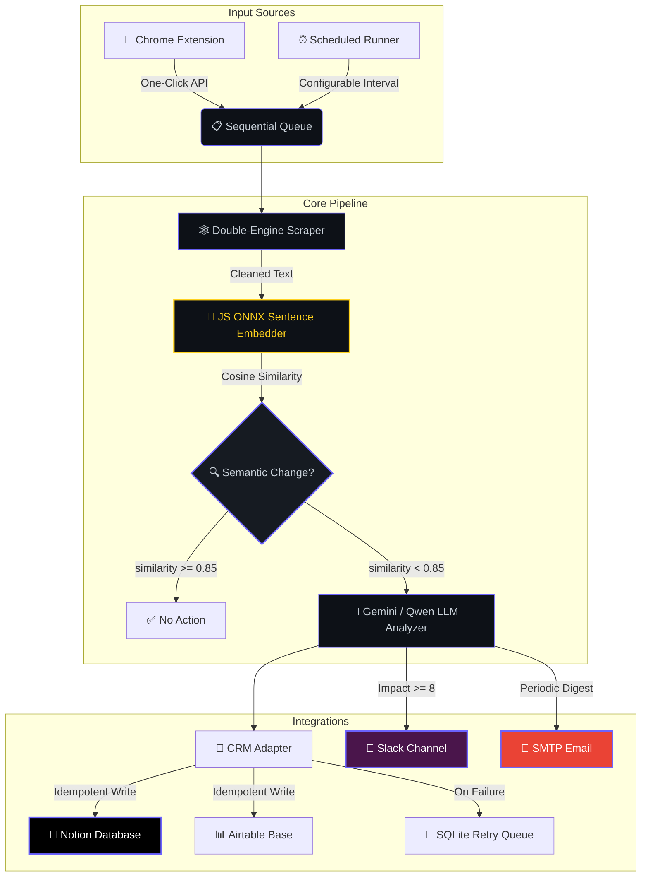
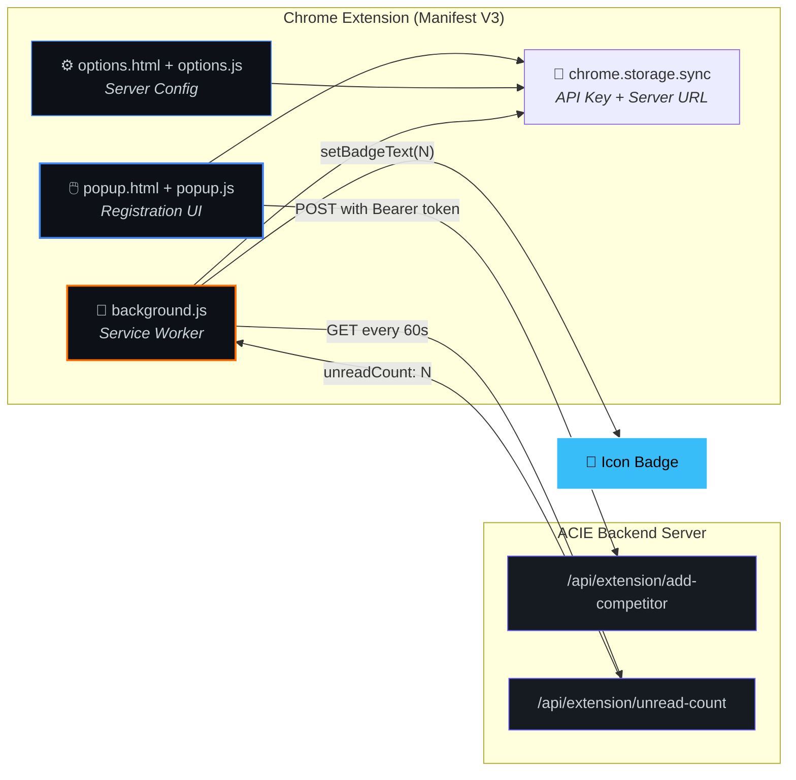

<div align="center">

<!-- Capsule Render Header -->


<br/>

<p>
<samp>
  An AI-powered engine that <b>scrapes</b> competitor websites, <b>detects</b> meaningful changes with semantic embeddings,<br/>
  <b>analyzes</b> business impact with LLMs, and <b>alerts</b> you in real time — all under 512 MB of RAM.
</samp>
</p>

<br/>

<!-- Tech Stack Badges -->
[](https://nodejs.org)
[](https://react.dev)
[](https://huggingface.co)
[](https://ai.google.dev)

[](https://notion.so)
[](https://slack.com)
[](mailto:)
[](https://developer.chrome.com)

<br/>

<!-- Status Badges -->


</div>

<br/>

---

## 📑 Table of Contents

- [Overview](#-overview)
- [System Architecture](#️-system-architecture)
- [The ML Pipeline](#-the-ml-pipeline)
- [Chrome Extension](#-chrome-extension)
- [Core Features](#-core-features)
- [Model Configurations](#-model-configurations)
- [Quick Start](#-quick-start)
- [Environment Variables](#-environment-variables)
- [API Reference](#-api-reference)
- [Integration Guides](#-integration-guides)
- [Tech Stack](#️-tech-stack)
- [Project Structure](#-project-structure)
- [Deployment](#-deployment)
- [Known Limitations](#️-known-limitations)
- [Contributing](#-contributing)
- [License](#-license)

---

## 🌟 Overview

> **ACIE** is an autonomous, self-healing competitor monitoring engine that scrapes competitor websites on a configurable schedule, detects *meaningful* content changes using **JavaScript ONNX sentence embeddings**, analyzes and scores business impact with **Gemini 2.5 Flash** (or a local **Qwen GGUF** fallback), and pushes real-time alerts to **Slack**, **Email**, and **Notion / Airtable CRM** — all within a **512 MB RAM** footprint.

<br/>

<div align="center">

| 🔬 Scrape | 🧠 Detect | 📊 Analyze & Score | 🚨 Alert |
|:---:|:---:|:---:|:---:|
| Axios + Puppeteer | JS ONNX Sentence Embeddings | Gemini 2.5 Flash / Qwen GGUF | Slack + Email + CRM |
| Static & JS-rendered pages | `Xenova/all-MiniLM-L6-v2` cosine sim | LLM classification + impact 1–10 | Real-time webhook push |

</div>

<br/>

### ✨ Key Highlights

- **Semantic understanding** — No brittle string diffs. Changes are compared by *meaning*, not characters.
- **Triple-tier LLM fallback** — Cloud → Local GGUF → Rule-based heuristics. Always works.
- **Multi-channel alerts** — Slack (instant, high-impact), Email (periodic digest), CRM (every change).
- **Chrome Extension** — One-click competitor registration from any browser tab.
- **Multi-workspace** — Isolated workspaces with per-workspace settings and API keys.
- **Self-healing** — Failed CRM syncs retry automatically via a local SQLite queue.

---

## 🗺️ System Architecture



---

## 🧬 The ML Pipeline

<table>
<tr>
<td width="50%">

### 🧠 Stage 1 — Semantic Change Detection
**JavaScript** • `@huggingface/transformers` • `Xenova/all-MiniLM-L6-v2` (ONNX)

```javascript
const { pipeline } = require('@huggingface/transformers');

const embedder = await pipeline(
  'feature-extraction',
  'Xenova/all-MiniLM-L6-v2'
);

const oldEmbed = await embedder("Price is $100",
  { pooling: 'mean', normalize: true });
const newEmbed = await embedder("Current Price: $100",
  { pooling: 'mean', normalize: true });

// Cosine similarity → 0.93 — Same meaning, NO alert! ✅
```

> ❌ **No string comparison** — the system understands *meaning*, not characters.

</td>
<td width="50%">

### 📊 Stage 2 — LLM Analysis & Scoring
**Node.js** • `Gemini 2.5 Flash API` / `Qwen2.5-0.5B GGUF`

Detected changes are sent to **Gemini 2.5 Flash** (cloud) or a **local Qwen2.5-0.5B GGUF** model (via llama-cli, CPU-only). The LLM returns structured output:

| Output | Description |
|:---|:---|
| 📂 **Category** | LLM-determined change type |
| 📝 **Summary** | Plain-English summary |
| ❓ **Why It Matters** | Business impact analysis |
| 📊 **Impact Score** | 1–10 threat/opportunity rating |
| 📋 **Justification** | Evidence-based reasoning |
| 🎯 **Recommendation** | Action item with timeline |

> 💡 Both classification and scoring happen in a **single inference pass**.

</td>
</tr>
</table>

### 🔄 Fallback Chain

```
Gemini 2.5 Flash API  →  Qwen2.5-0.5B GGUF (llama-cli, CPU)  →  Rule-Based Heuristic Engine
      Cloud                     Local (~382 MB)                       Keyword matching
```

When cloud or local LLM inference is unavailable (rate limits, cold starts, missing API key), a **rule-based heuristic engine** assigns categories and approximate impact scores via keyword matching on the diff text.

---

## 🧩 Chrome Extension

<div align="center">

[]()
[]()
[]()

</div>

<br/>

The **ACIE Chrome Extension** turns your browser into a competitor registration tool. Browse any competitor's website, click the extension icon, and it's instantly queued for monitoring.

| Feature | Description |
|:---|:---|
| 🖱️ **One-Click Add** | Auto-detects the active tab's URL and infers the competitor name from the domain |
| 🔴 **Live Badge** | Background service worker polls every 60s — new intel lights up a badge counter |
| 🔑 **API Key Auth** | All requests secured with `Bearer` token, configured via the Options page |
| 🎯 **Scope Selector** | Monitor full website, pricing page, or a specific section |

<details>
<summary><b>📐 Extension Architecture Diagram</b></summary>
<br/>



</details>

<details>
<summary><b>🔧 Installation</b></summary>
<br/>

1. Open `chrome://extensions/` and enable **Developer mode** (top-right toggle)
2. Click **Load unpacked** → select the `extension/` directory
3. Click the extension icon → **Configure Server Settings**
4. Enter your server URL (e.g., `http://localhost:3000`) and Extension API Key (from the dashboard Settings tab)
5. Click **Verify and Save** — you're ready to go!

</details>

---

## ⚡ Core Features

<details open>
<summary><b>🕸️ 1. Intelligent Double-Engine Scraper</b></summary>
<br/>

| Engine | Library | Purpose |
|:---|:---|:---|
| ⚡ Fast Fetch | `axios` + `cheerio` | Static HTML pages — fast and lightweight |
| 🌐 JS Render | `puppeteer` (headless Chromium) | SPAs, React/Angular apps with dynamic content |

**Smart Cleaning Pipeline:**
- 🧹 Strips cookie banners, navigation bars, footers, sidebars
- 🔄 Rotates User-Agent strings to avoid bot detection
- 🖼️ Blocks images/CSS in Puppeteer to minimize memory footprint
- 📸 Captures visual screenshots for audit trails

</details>

<details>
<summary><b>🔍 2. Tech Stack & DNS Enrichment</b></summary>
<br/>

- 🌐 **DNS Resolution** — A-records and MX-records for server & email hosting detection
- 🔧 **Header Inspection** — Reads `server`, `x-powered-by` HTTP headers
- 📊 **Dashboard Widget** — Shows enriched tech profiles directly in the competitor sidebar

</details>

<details>
<summary><b>💼 3. Idempotent CRM Sync & Fail-Safe Queue</b></summary>
<br/>

- 🔒 **Deduplication** — Queries Notion/Airtable before writes to prevent duplicates
- 🔄 **SQLite Retry Queue** — Failed syncs are queued locally and auto-retried periodically
- 📊 **Dynamic Schema Matching** — Case-insensitive, whitespace-tolerant property matching
- ✅ **Status Tracking** — Each card tracks `synced`, `failed`, or `pending` state

</details>

<details>
<summary><b>📢 4. Multi-Channel Alert System</b></summary>
<br/>

| Channel | Trigger | Content |
|:---|:---|:---|
| 💬 **Slack** | Impact Score ≥ 8 | Immediate webhook with full intelligence card |
| 📧 **Email** | Periodic digest schedule | HTML-formatted summary of recent changes |
| 📓 **Notion** | Every detected change | Structured database row with all fields |
| 📊 **Airtable** | Every detected change | Structured record with all fields |

</details>

---

## 🤖 Model Configurations

<div align="center">

| Component | Model | Runtime | Disk | RAM | Latency |
|:---|:---|:---|:---|:---|:---|
| 🔍 **Embeddings** | `Xenova/all-MiniLM-L6-v2` | `@huggingface/transformers` (ONNX) | ~90 MB | ~80 MB | < 0.5s |
| 🧠 **LLM (Cloud)** | `gemini-2.5-flash` | Google Generative Language API | — | — | < 1.5s |
| 🧠 **LLM (Local)** | `Qwen2.5-0.5B-Instruct` | llama-cli (GGUF Q4_K_M) | ~382 MB | ~350 MB | 7–15s |
| 🔧 **Fallback** | Rule-based heuristic | Node.js keyword matching | — | — | < 1ms |

</div>

> 💡 **Tip:** Set `GEMINI_API_KEY` in `.env` for cloud inference. Without it, the engine auto-falls back to local Qwen GGUF, then to rule-based heuristics.

---

## 🚀 Quick Start

### Prerequisites

```
✅ Node.js    v18+
✅ NPM        v10+
✅ OS         macOS / Linux / Windows (WSL)
```

### 1. Clone & Install

```bash
git clone https://github.com/NitheshK4/Autonomous-Competitor-Intelligence-Engine.git
cd Autonomous-Competitor-Intelligence-Engine

# Install all dependencies (root + server + client)
npm install
npm run install:all
```

> 💡 **No Python required!** All ML inference runs natively in Node.js via ONNX or external binaries.

### 2. Configure Environment

```bash
cp .env.example .env
```

Edit `.env` with your configuration (see [Environment Variables](#-environment-variables) for the full list).

### 3. Launch Dev Servers

```bash
npm run dev
```

| Service | URL |
|:---|:---|
| 🖥️ Backend API | `http://localhost:3000` |
| 🎨 Dashboard | `http://localhost:5173` |

### 4. Run Integration Tests

```bash
npm test
```

Validates the full pipeline: Scraping → Semantic Detection → LLM Inference → CRM Sync.

---

## 🔐 Environment Variables

Create a `.env` file in the project root. Only `PORT` is required — everything else is optional and unlocks additional features.

| Variable | Required | Default | Description |
|:---|:---:|:---:|:---|
| `PORT` | ✅ | `3000` | Express server port |
| `NODE_ENV` | — | `development` | Set to `production` for optimized builds |
| `GEMINI_API_KEY` | — | — | Google Gemini 2.5 Flash API key ([get one](https://ai.google.dev)) |
| `SLACK_WEBHOOK_URL` | — | — | Slack Incoming Webhook for real-time alerts |
| `PUPPETEER_EXECUTABLE_PATH` | — | bundled | Override Chrome path (useful in Docker/Railway) |

> Notion, Airtable, and SMTP credentials are configured via the **dashboard Settings tab** at runtime — no `.env` entry needed.

---

## 📡 API Reference

All dashboard endpoints use the `X-Workspace-Id` header (defaults to `default`). Extension endpoints require `Authorization: Bearer <api_key>`.

<details>
<summary><b>📋 Dashboard Endpoints</b></summary>
<br/>

| Method | Endpoint | Description |
|:---|:---|:---|
| `GET` | `/health` | Health check / keep-alive |
| `GET` | `/api/profile` | Get business profile |
| `POST` | `/api/profile` | Save/update business profile |
| `GET` | `/api/competitors` | List all competitors |
| `POST` | `/api/competitors` | Add a new competitor |
| `GET` | `/api/competitors/:id` | Get competitor details |
| `PUT` | `/api/competitors/:id` | Update a competitor |
| `DELETE` | `/api/competitors/:id` | Remove a competitor |
| `POST` | `/api/competitors/:id/check` | Trigger immediate scrape |
| `GET` | `/api/intelligence` | Get intelligence cards |
| `PUT` | `/api/intelligence/:id` | Update an intel card (read/unread) |
| `POST` | `/api/intelligence/read-all` | Mark all cards as read |
| `POST` | `/api/intelligence/:id/retry` | Retry failed CRM sync |
| `GET` | `/api/settings` | Get workspace settings |
| `POST` | `/api/settings` | Save workspace settings |
| `POST` | `/api/settings/test-email` | Test SMTP connection |
| `GET` | `/api/debug-status` | Pipeline debug status |

</details>

<details>
<summary><b>🧩 Extension Endpoints</b></summary>
<br/>

| Method | Endpoint | Auth | Description |
|:---|:---|:---|:---|
| `GET` | `/api/extension/status` | Bearer | Connection health check |
| `GET` | `/api/extension/unread-count` | Bearer | Get unread card count (for badge) |
| `POST` | `/api/extension/add-competitor` | Bearer | Register a competitor from the browser |

</details>

---

## 🔌 Integration Guides

<details>
<summary><b>📓 Notion CRM</b></summary>
<br/>

1. Create an integration at **[Notion My Integrations](https://www.notion.so/my-integrations)**
2. Create a database with these properties:

| Property | Type |
|:---|:---|
| Title | `Title` (default) |
| Competitor Name | `Select` |
| URL | `URL` |
| Category | `Select` |
| Impact Score | `Number` |
| Recommended Action | `Text` |
| Summary | `Text` |
| Justification | `Text` |
| Screenshot URL | `URL` |

3. Connect your integration to the database via `...` → **Connect to**
4. Copy the **Database ID** from the page URL
5. Enter credentials in the dashboard **Settings** panel

</details>

<details>
<summary><b>📊 Airtable CRM</b></summary>
<br/>

1. Generate a PAT with `data.records:write` at **[Airtable Developer Hub](https://airtable.com/create/tokens)**
2. Create a Base → Table named **Competitor Intel** with matching fields
3. Enter Base ID, Table name, and Token in dashboard Settings

</details>

<details>
<summary><b>💬 Slack Alerts</b></summary>
<br/>

1. Create an **Incoming Webhook** in your Slack workspace
2. Paste the webhook URL in dashboard Settings
3. Changes with **Impact Score ≥ 8** trigger instant Slack alerts ⚡

</details>

<details>
<summary><b>📧 SMTP Email Digest</b></summary>
<br/>

1. For Gmail: Generate an **App Password** at `security.google.com`
2. Configure in Settings: Host `smtp.gmail.com`, Port `587`
3. Click **Test SMTP Connection** to verify
4. Periodic digests will arrive in your inbox automatically 📬

</details>

---

## 🛠️ Tech Stack

<div align="center">


</div>

<br/>

| Layer | Technologies |
|:---|:---|
| 🖥️ **Backend** | Node.js 18+, Express 4, SQLite (`sqlite3` + `sqlite`), UUID |
| 🎨 **Frontend** | React 18, Vite 5 |
| 🕸️ **Scraping** | Axios, Cheerio, Puppeteer (headless Chromium) |
| 🧠 **AI / ML** | `@huggingface/transformers` (ONNX), Gemini 2.5 Flash, Qwen2.5-0.5B GGUF (llama-cli) |
| 🔌 **Integrations** | Notion API (`@notionhq/client`), Airtable (REST), Slack Webhooks, Nodemailer SMTP |
| 🧩 **Extension** | Chrome Manifest V3, Service Workers, `chrome.storage` API |
| 🔧 **Dev Tooling** | Concurrently, Nodemon, Docker |

---

## 📁 Project Structure

```
📦 Autonomous-Competitor-Intelligence-Engine
│
├── 📂 client/                        # React + Vite dashboard
│   ├── 📂 src/
│   │   ├── App.jsx                   # Root dashboard (single-file application)
│   │   ├── index.css                 # Global styles
│   │   └── main.jsx                  # React entry point
│   ├── index.html                    # HTML template
│   └── vite.config.js                # Vite configuration with API proxy
│
├── 📂 server/                        # Node.js + Express backend
│   └── 📂 src/
│       ├── index.js                  # Express server, routes, scheduler
│       ├── scraper.js                # Double-engine scraper (Axios + Puppeteer)
│       ├── detector.js               # Semantic change detection (ONNX embeddings)
│       ├── llm.js                    # LLM inference (Gemini / Qwen GGUF / fallback)
│       ├── crm.js                    # Notion & Airtable CRM adapter
│       ├── queue.js                  # Sequential processing queue
│       ├── slack.js                  # Slack webhook alerts
│       ├── mailer.js                 # SMTP email digest (Nodemailer)
│       ├── enrichment.js             # DNS + header tech stack enrichment
│       ├── db.js                     # SQLite database layer
│       └── verify-test.js            # Integration test suite
│
├── 📂 extension/                     # Chrome Extension (Manifest V3)
│   ├── manifest.json                 # MV3 config & permissions
│   ├── popup.html / popup.js         # One-click competitor registration
│   ├── options.html / options.js     # Server URL & API key settings
│   ├── background.js                 # Service worker — badge polling
│   └── icon*.png                     # Extension icons (16, 48, 128)
│
├── 📂 docs/                          # Documentation & screenshots
│
├── data_exporter.py                  # Standalone CSV/Markdown export (Python stdlib)
├── Dockerfile                        # Production container config
├── package.json                      # Root workspace orchestrator
└── .env.example                      # Environment template
```

---

## 🐳 Deployment

### Railway (Recommended)

The included `Dockerfile` handles everything — Chrome installation, model downloads, Vite build, and Express routing.

```bash
# Railway reads the Dockerfile automatically:
# ✅ Chrome for Puppeteer
# ✅ ONNX + GGUF model downloads
# ✅ Vite static build
# ✅ Express server
```

1. Create a **New Project** on [Railway](https://railway.app)
2. Link your GitHub repository
3. Add environment variables: `PORT=3000`, `GEMINI_API_KEY=...`
4. Deploy! 🚀

### Docker (Manual)

```bash
docker build -t acie .
docker run -p 3000:3000 --env-file .env acie
```

---

## ⚠️ Known Limitations

| Issue | Details |
|:---|:---|
| ⏳ **Cold Start** | First run downloads ML models (~90 MB ONNX + ~382 MB GGUF). Cached after that. |
| 🤖 **Anti-Bot** | Some sites block headless scrapers. The engine gracefully falls back to Axios. |
| 📋 **Sequential Queue** | Competitors are processed one-at-a-time to stay under 512 MB RAM. |
| 🔄 **LLM Rate Limits** | Gemini may rate-limit under heavy use → auto-fallback to local GGUF → heuristics. |

---

## 🤝 Contributing

Contributions are welcome! Here's how to get started:

1. **Fork** the repository
2. **Create** a feature branch: `git checkout -b feature/amazing-feature`
3. **Commit** your changes: `git commit -m 'Add amazing feature'`
4. **Push** to the branch: `git push origin feature/amazing-feature`
5. **Open** a Pull Request

Please make sure your code passes `npm test` before submitting.

---

## 📜 License

This project is licensed under the **MIT License** — see the [LICENSE](LICENSE) file for details.

---

<div align="center">


<br/>

**Built with ❤️ by [Nithesh K](https://github.com/NitheshK4)**

<br/>

[](LICENSE)
[](https://github.com/NitheshK4/Autonomous-Competitor-Intelligence-Engine/stargazers)

</div>
