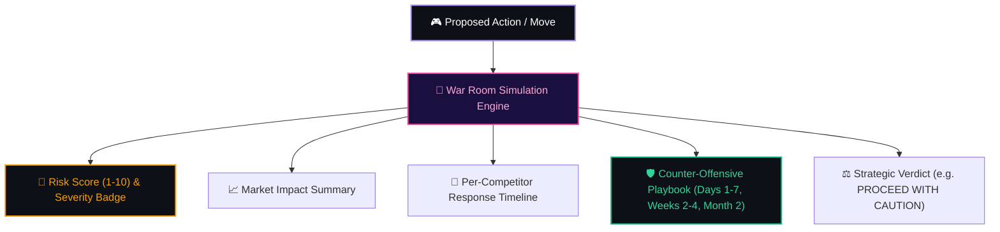
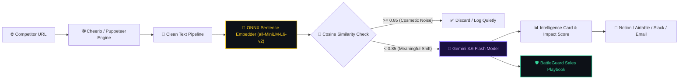

<div align="center">

```
  ███╗   ███╗██╗██████╗  █████╗      ██████╗ ██████╗  █████╗  ██████╗███████╗
  ████╗ ████║██║██╔══██╗██╔══██╗    ██╔═══██╗██╔══██╗██╔══██╗██╔════╝██╔════╝
  ██╔████╔██║██║██████╔╝███████║    ██║   ██║██████╔╝███████║██║     █████╗  
  ██║╚██╔╝██║██║██╔══██╗██╔══██║    ██║   ██║██╔══██╗██╔══██║██║     ██╔══╝  
  ██║ ╚═╝ ██║██║██║  ██║██║  ██║    ╚██████╔╝██║  ██║██║  ██║╚██████╗███████╗
  ╚═╝     ╚═╝╚═╝╚═╝  ╚═╝╚═╝  ╚═╝     ╚═════╝ ╚═╝  ╚═╝╚═╝  ╚═╝ ╚═════╝╚══════╝
```

### ⚡ Autonomous Competitor Intelligence & BattleGuard Defense Engine ⚡

*Powered by Google DeepMind's **Gemini 3.6 Flash**, ONNX Vector Embeddings, and Real-Time Game-Theory War Room Simulations.*

<br/>

<a href="https://autonomous-competitor-intelligence-engine-production.up.railway.app/">
  
</a>

<br/><br/>

<!-- Dynamic Badges Row 1 -->
[](https://ai.google.dev)
[](#-battleguard-sales-defense-center)
[](#-ml--prediction-architecture)
[](#-chrome-extension)

<!-- Dynamic Badges Row 2 -->
[](https://nodejs.org)
[](https://react.dev)
[](https://tailwindcss.com)
[](https://sqlite.org)

<br/>

<!-- Metric Pills -->


[](https://github.com/NitheshK4/Autonomous-Competitor-Intelligence-Engine/stargazers)

</div>

<br/>

---

## 💡 What Makes MIRA Unique?

Traditional competitor monitoring tools break when websites change spacing, font colors, or timestamps. They spam your Slack with useless alerts whenever a copyright year updates.

**MIRA changes everything.**

MIRA combines **real-time vector embeddings**, **Gemini 3.6 Flash AI intelligence**, and a **sales battleguard matrix** into a single autonomous engine:

```
  ┌─────────────────────────────────────────────────────────────────────────────┐
  │                           M I R A   A R C H I T E C T U R E                 │
  ├──────────────┬──────────────┬──────────────┬──────────────┬─────────────────┤
  │ 🕸️ Scrape    │ 🧠 Vectorize │ 🔮 Predict   │ 🛡️ Defend    │ ⚔️ Simulate     │
  │ Double-Engine│ ONNX MiniLM  │ Gemini 3.6   │ BattleGuard  │ War Room        │
  │ Cheerio +    │ Cosine Math  │ Flash 1-10   │ 0-100 Gauge  │ Game-Theory     │
  │ Puppeteer    │ Noise Filter │ Impact Card  │ Counter Scripts Playbooks       │
  └──────────────┴──────────────┴──────────────┴──────────────┴─────────────────┘
```

- 🎯 **Semantic Zero-Noise Change Detection**: Uses HuggingFace ONNX embeddings (`Xenova/all-MiniLM-L6-v2`) in Node.js to evaluate text by *meaning*, ignoring cosmetic layout noise.
- 🔮 **Gemini 3.6 Flash Predictions**: Automatically classifies market signals, predicts business impact, and calculates threat severity scores.
- 🛡️ **BattleGuard™ Sales Defense HUD**: Calculates quantitative **0–100 Defense Scores**, live threat badges (`CRITICAL`, `HIGH`, `MODERATE`, `LOW`), threat vectors, and interactive objection scripts.
- ⚔️ **Competitive War Room Simulator**: Run *"What-If"* market scenarios (e.g. *"What if competitor drops price by 30%?"*) to predict reaction timelines and generate counter-offensive playbooks.
- 💻 **100% Offline Capability**: If API limits are reached, MIRA automatically falls back to an embedded local **Qwen2.5 GGUF CPU engine**.
- 🩹 **Self-Healing CRM Sync**: Idempotent sync to **Notion** & **Airtable** with background SQLite retry queue. Zero data loss.

---

## 🛡️ BattleGuard™ Sales Enablement HUD

The **BattleGuard Center** transforms competitor signals into active sales ammunition during live prospect calls:

```
+-----------------------------------------------------------------------------+
| 🛡️ BATTLEGUARD DEFENSE HUD  --  APEX COMPETITOR RADAR                        |
+-----------------------------------------------------------------------------+
|                                                                             |
|  [ 📊 DEFENSE INDEX: 88/100 ]     [ 🚨 THREAT LEVEL: HIGH IMPACT ]           |
|  [==========================......]                                         |
|                                                                             |
|  🎯 ACTIVE THREAT VECTORS:                                                  |
|     1. [PRICING] Undercut base pricing by $10/mo ($70 vs $80)               |
|     2. [PRODUCT] Released beta workflow automation module                   |
|                                                                             |
|  🛡️ DEFENSIVE TACTICS & COUNTER-SCRIPTS:                                    |
|     • Pricing Guard  -> Highlight total cost of ownership & zero add-on fees|
|     • Feature Counter -> Demonstrate real-time ONNX change engine & SLAs   |
|     • Switching SLA   -> Offer zero-friction onboarding & data import       |
|                                                                             |
|  🗣️ 30-SECOND ELEVATOR PITCH:                                               |
|     "While Apex offers legacy workflows, our solution delivers 3x faster     |
|      setup, direct dedicated support, and guaranteed zero hidden seat fees."|
|                                                                             |
+-----------------------------------------------------------------------------+
```

### ⚡ Feature Capabilities

- **Interactive Objection Simulator**: Type any objection a buyer raises during a live call to get an instant winning script.
- **ICP Target Persona Fit**: Explains why prospects choose your solution over the competitor.
- **Customer Switching Triggers**: Highlights migration triggers (e.g., unexpected pricing hikes, poor support SLAs).
- **Markdown Cheat Sheet Export**: Download full `.md` cheat sheets with a single click.

---

## 🔮 Gemini 3.6 & Multi-Model Engine Matrix

Choose your AI prediction model dynamically from the dashboard Settings tab:

| Model ID | Engine Class | Latency | Primary Use Case |
|:---|:---|:---:|:---|
| 🔮 **`gemini-3.6-flash`** | **Default Frontier** | **<1.2s** | **Primary Prediction Engine for change analysis, BattleGuard & War Room** |
| 🔥 **`gemini-3.0-flash`** | Next-Gen 3.0 | <1.4s | High-speed competitive change processing |
| 🌟 **`gemini-3.0-pro`** | Frontier Pro | <2.1s | Deep multi-agent strategy & complex game-theory modeling |
| ✨ **`gemini-2.5-flash`** | Core Flash | <1.5s | Balanced intelligence & playbook generation |
| 🧠 **`gemini-2.5-pro`** | Reasoning Pro | <2.5s | Deep SWOT audits & enterprise positioning |
| ⚡ **`gemini-2.0-flash`** | Multimodal Fast | <1.0s | Ultra low-latency objection handling lookups |
| 🚀 **`gemini-2.0-flash-lite`** | High Throughput | <0.8s | High-frequency bulk competitor monitoring |
| 💻 **`local-qwen-gguf`** | **100% Offline GGUF** | **4-8s** | **Runs 100% locally on CPU via `llama-cli` without API keys** |

---

## ⚔️ War Room Simulator — Game Theory Modeling

> *"What happens if we launch a freemium tier tomorrow?"*

The **War Room Engine** runs multi-agent competitive simulations to predict market dynamics:



---

## 🧠 ML & Semantic Vector Pipeline



---

## 🧩 Chrome Manifest V3 Extension

Register competitors in one click straight from your browser tab:

- 🖱️ **Instant Target Capture**: Automatically extracts tab URL and infers company name.
- 🔴 **Live Unread Intel Badge**: Background service worker polls MIRA every 60s and updates the extension badge icon counter.
- 🔑 **Bearer Token Auth**: Authenticated via workspace settings.

---

## 🚀 Quick Start (Local Setup)

### Prerequisites

- **Node.js**: v20+
- **NPM**: v10+
- **Memory**: Runs under **512 MB RAM**
- **Python**: *None required! All ML runs natively in JavaScript.*

### 1️⃣ Clone & Install

```bash
git clone https://github.com/NitheshK4/Autonomous-Competitor-Intelligence-Engine.git
cd Autonomous-Competitor-Intelligence-Engine

npm install
npm run install:all
```

### 2️⃣ Environment Setup

```bash
cp .env.example .env
# Set PORT=3000 — all API keys (Gemini, Slack, Notion, Airtable, SMTP)
# are configured interactively via the dashboard Settings tab!
```

### 3️⃣ Launch Application

```bash
npm run dev
```

- 🖥️ **Backend Server**: `http://localhost:3000`
- 🎨 **React Dashboard**: `http://localhost:5173`

### 4️⃣ Run Integration Verification Suite

```bash
npm test
```

> **Validates 5 Test Suites**: Static Scraping → ONNX Semantic Detection → LLM Predictions → CRM Retry Queue → BattleGuard Metrics & DB Persistence.

---

## 📡 API Reference Directory

Dashboard calls require `x-workspace-id` header (defaults to `default`).

<details>
<summary><b>🔍 Click to view all 20+ API Endpoints</b></summary>

<br/>

| Method | Path | Description |
|:---|:---|:---|
| `GET` | `/health` | Server health check |
| `GET` | `/api/profile` | Get business profile |
| `POST` | `/api/profile` | Save business profile |
| `GET` | `/api/competitors` | List monitored competitors |
| `POST` | `/api/competitors` | Register new competitor target |
| `POST` | `/api/competitors/:id/check` | Trigger immediate scrape & change detection |
| `GET` | `/api/intelligence` | List intelligence cards |
| `GET` | `/api/battlecards` | List battlecards & BattleGuard metrics |
| `GET` | `/api/battlecards/:id` | Get single battlecard |
| `POST` | `/api/battlecards/:id/generate` | Generate / refresh BattleGuard playbook |
| `POST` | `/api/oracle/chat` | Chat with MIRA Oracle AI Co-Pilot |
| `POST` | `/api/warroom/simulate` | Run War Room scenario simulation |
| `GET` | `/api/settings` | Fetch workspace settings & active model |
| `POST` | `/api/settings` | Update settings & API keys |
| `GET` | `/api/extension/unread-count` | Unread intel count for Chrome extension |
| `POST` | `/api/extension/add-competitor` | Add competitor from Chrome extension |

</details>

---

## 🔌 Enterprise CRM & Alert Integrations

- 📓 **Notion CRM**: Automatic page creation with property mapping (`Category`, `Impact Score`, `Summary`, `Action`).
- 📊 **Airtable**: Idempotent table record creation.
- 💬 **Slack Webhooks**: Instant alerts fired for high-impact competitor moves ($\ge 8/10$).
- 📧 **SMTP Email**: Periodic executive digest emails sent to your team.

---

## 🛠️ Complete Tech Stack

<div align="center">


</div>

<br/>

- 🖥️ **Backend**: Node.js 20, Express 4, SQLite (`sqlite3`), Cheerio, Puppeteer, Axios
- 🎨 **Frontend**: React 18, Vite 5, Tailwind CSS 3, Lucide React
- 🧠 **AI & ML**: Google Gemini 3.6 Flash, HuggingFace ONNX Embeddings (`all-MiniLM-L6-v2`), Qwen2.5 GGUF
- 🛡️ **Sales Enablement**: BattleGuard HUD Engine, Defense Index Gauge, Interactive Objection Simulator
- 🔮 **Strategy Suite**: MIRA Oracle Co-Pilot, War Room Simulator
- 🔌 **Integrations**: Notion SDK, Airtable REST API, Slack Webhooks, Nodemailer SMTP
- 🧩 **Browser Extension**: Chrome Manifest V3, Service Workers

---

## 📁 Repository Structure

```
📦 Autonomous-Competitor-Intelligence-Engine
├── 📂 client/                     # React 18 + Vite Dashboard
│   ├── src/
│   │   ├── App.jsx                # Application root & settings
│   │   └── components/
│   │       ├── BattlecardsView.jsx   # 🛡️ BattleGuard Sales Defense HUD
│   │       ├── CommandPalette.jsx    # 🔍 Cmd+K Global Search
│   │       ├── Sidebar.jsx           # 📱 Navigation Sidebar
│   │       ├── StrategyCopilotModal.jsx # 🔮 MIRA Oracle AI Chat
│   │       └── WarRoomView.jsx       # ⚔️ War Room Simulator
├── 📂 server/                     # Express Backend Engine
│   └── src/
│       ├── index.js               # API Server & Cron Scheduler
│       ├── scraper.js             # Double-Engine Scraper (Cheerio + Puppeteer)
│       ├── detector.js            # ONNX Semantic Vector Embedder
│       ├── llm.js                 # Gemini 3.6 Flash + BattleGuard + War Room
│       ├── crm.js                 # Notion & Airtable Adapter
│       └── db.js                  # SQLite Database & Migrations
├── 📂 extension/                  # Chrome Extension (Manifest V3)
├── Dockerfile                     # Containerization (Node 20 + Chromium)
└── package.json                   # Dependencies & Scripts
```

---

## 🐳 Deployment (Docker & Railway)

### Deploy to Railway

1. Connect your GitHub repository to [Railway](https://railway.app).
2. Set environment variables: `PORT=3000`, `NODE_ENV=production`.
3. Railway automatically detects the `Dockerfile` and deploys your container! 🚀

### Local Docker Build

```bash
docker build -t mira .
docker run -p 3000:3000 --env-file .env mira
```

---

## 🤝 Contributing

Contributions are warmly welcome! Please follow these steps:

1. Fork the repository.
2. Create your feature branch (`git checkout -b feature/AmazingFeature`).
3. Commit your changes (`git commit -m 'feat: Add AmazingFeature'`).
4. Run `npm test` to ensure all 5 test suites pass.
5. Push to the branch (`git push origin feature/AmazingFeature`).
6. Open a Pull Request.

---

## 📜 License

Distributed under the **MIT License**. See `LICENSE` for more information.

<br/>

<div align="center">

**[ 🔮 MIRA Engine ]** • **[ 🛡️ BattleGuard HUD ]** • **[ 🔮 Gemini 3.6 Flash ]** • **[ ⚔️ War Room ]**

</div>
