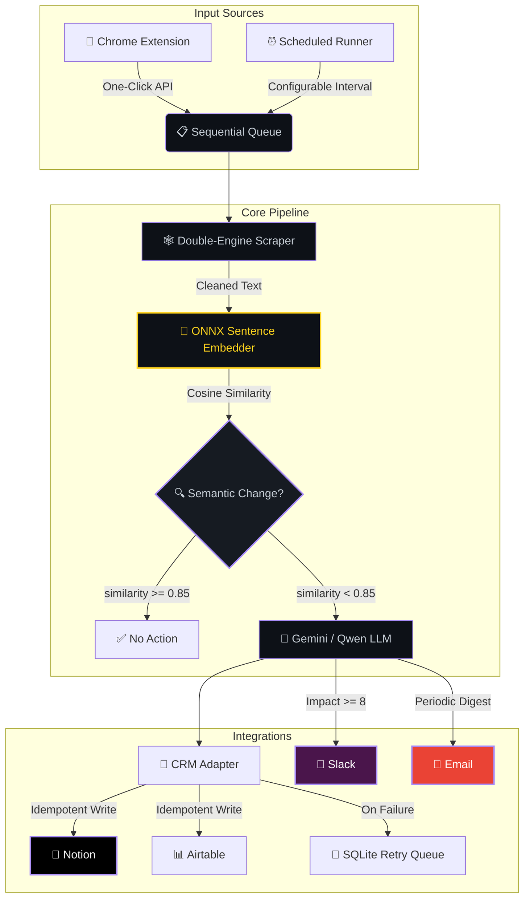
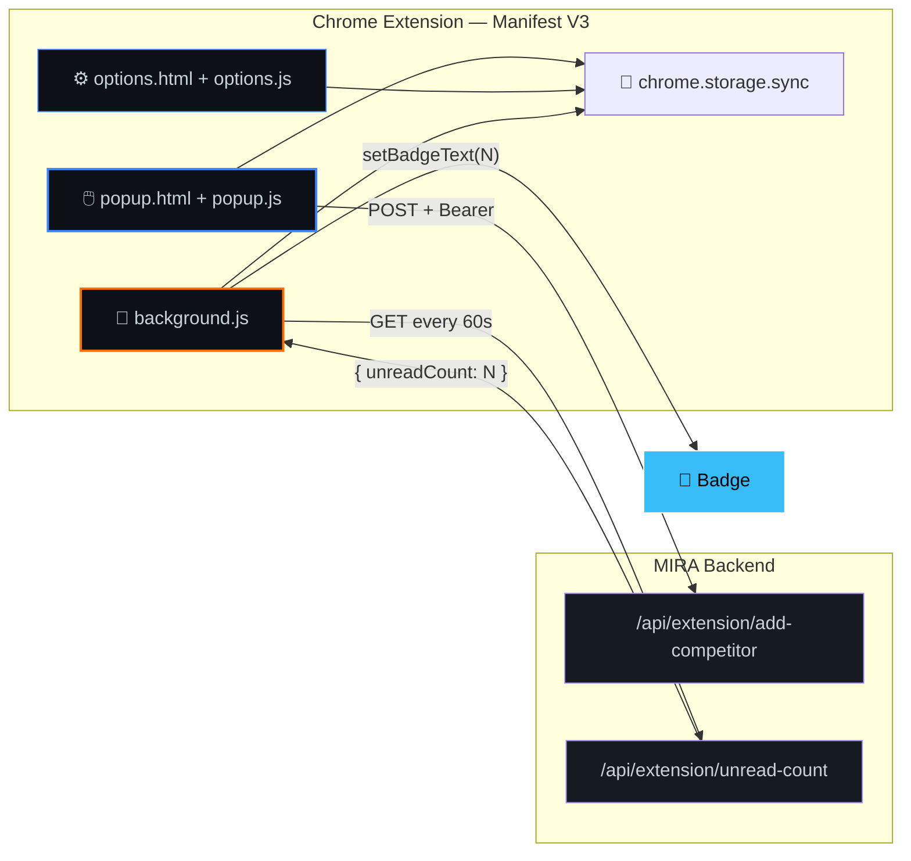

<div align="center">

<!-- Animated Header -->


<!-- Typing Animation -->
<br/>
<a href="#-overview">

</a>

<br/><br/>

<!-- Primary Badges -->
[](https://nodejs.org)
[](https://react.dev)
[](https://tailwindcss.com)
[](https://ai.google.dev)
[](https://huggingface.co)
[](https://developer.chrome.com)

[](https://slack.com)
[](https://notion.so)
[](mailto:)
[](https://sqlite.org)
[](https://docker.com)

<br/>


[](https://github.com/NitheshK4/MIRA/stargazers)

</div>

<br/>


## 📑 Table of Contents

<details open>
<summary>Click to expand</summary>

- [Overview](#-overview)
- [Live Demo](#-live-demo)
- [System Architecture](#️-system-architecture)
- [ML Pipeline](#-ml-pipeline)
- [Chrome Extension](#-chrome-extension)
- [Core Features](#-core-features)
- [Model Configurations](#-model-configurations)
- [Quick Start](#-quick-start)
- [Environment Variables](#-environment-variables)
- [API Reference](#-api-reference)
- [Integration Guides](#-integration-guides)
- [Tech Stack](#️-tech-stack)
- [Project Structure](#-project-structure)
- [Deployment](#-deployment)
- [Known Limitations](#️-known-limitations)
- [Contributing](#-contributing)
- [License](#-license)

</details>


## 🌟 Overview

> **MIRA** (**M**arket **I**ntelligence & **R**esearch **A**utomation) is an autonomous, self-healing competitor monitoring engine. It scrapes competitor websites on a configurable schedule, detects *meaningful* content changes using **ONNX sentence embeddings**, analyzes business impact with **Gemini 2.5 Flash** (with a local **Qwen GGUF** fallback), and pushes real-time alerts to **Slack**, **Email**, and **Notion / Airtable CRM** — all within a **512 MB RAM** footprint.

<br/>

<div align="center">

| 🔬 Scrape | 🧠 Detect | 📊 Analyze & Score | 🚨 Alert |
|:---:|:---:|:---:|:---:|
| Axios + Puppeteer | ONNX Sentence Embeddings | Gemini 2.5 Flash / Qwen GGUF | Slack + Email + CRM |
| Static & JS-rendered pages | Cosine similarity threshold | Classification + Impact 1–10 | Real-time webhook push |

</div>

<br/>

### ✨ Why MIRA?

<table>
<tr>
<td>

**🧠 Semantic Understanding**<br/>
No brittle string diffs. Changes are compared by *meaning*, not characters. "Price is $100" ≈ "Current Price: $100" → no false alert.

</td>
<td>

**🔄 Triple-Tier Fallback**<br/>
Cloud LLM → Local GGUF → Rule-based heuristics. MIRA always produces analysis, even fully offline.

</td>
</tr>
<tr>
<td>

**📢 Multi-Channel Alerts**<br/>
Slack (instant, high-impact ≥ 8), Email (periodic digest), Notion/Airtable (every change logged).

</td>
<td>

**🩹 Self-Healing**<br/>
Failed CRM syncs auto-retry via a local SQLite queue. No data loss, ever.

</td>
</tr>
<tr>
<td>

**🧩 Chrome Extension**<br/>
One-click competitor registration from any browser tab. Live badge shows unread intel count.

</td>
<td>

**🏢 Multi-Workspace**<br/>
Isolated workspaces with per-workspace settings, API keys, and competitor lists.

</td>
</tr>
</table>


## 🚀 Live Demo

> The app is deployed on Railway and publicly accessible:

**👉 [https://autonomous-competitor-intelligence-engine-production.up.railway.app/](https://autonomous-competitor-intelligence-engine-production.up.railway.app/)**


## 🗺️ System Architecture




## 🧬 ML Pipeline

<table>
<tr>
<td width="50%">

### 🧠 Stage 1 — Semantic Change Detection

**Runtime:** `@huggingface/transformers` (ONNX, JavaScript)
**Model:** `Xenova/all-MiniLM-L6-v2`

```javascript
const { pipeline } = require('@huggingface/transformers');

const embedder = await pipeline(
  'feature-extraction',
  'Xenova/all-MiniLM-L6-v2'
);

const oldEmbed = await embedder("Price is $100",
  { pooling: 'mean', normalize: true });
const newEmbed = await embedder("Current Price: $100",
  { pooling: 'mean', normalize: true });

// Cosine similarity → 0.93
// Same meaning — NO alert triggered ✅
```

> ❌ No string comparison — MIRA understands *meaning*, not characters.

</td>
<td width="50%">

### 📊 Stage 2 — LLM Analysis & Scoring

**Cloud:** Gemini 2.5 Flash API
**Local:** Qwen2.5-0.5B GGUF via llama-cli (CPU)

Detected changes are analyzed in a **single inference pass**. The LLM returns structured output:

| Output | Description |
|:---|:---|
| 📂 **Category** | LLM-classified change type |
| 📝 **Summary** | Plain-English explanation |
| ❓ **Why It Matters** | Business impact analysis |
| 📊 **Impact Score** | 1–10 threat/opportunity rating |
| 📋 **Justification** | Evidence-based reasoning |
| 🎯 **Recommendation** | Action item with timeline |

</td>
</tr>
</table>

### 🔄 Fallback Chain

```
┌─────────────────────┐     ┌──────────────────────────┐     ┌─────────────────────────┐
│  Gemini 2.5 Flash   │────▶│  Qwen2.5-0.5B GGUF       │────▶│  Rule-Based Heuristics  │
│  (Cloud, <1.5s)     │     │  (Local, CPU, 7-15s)      │     │  (Keyword match, <1ms)  │
└─────────────────────┘     └──────────────────────────┘     └─────────────────────────┘
```

> When cloud inference is unavailable (rate limits, missing API key), MIRA falls back to local GGUF, then to keyword-based heuristics. **Analysis always completes.**


## 🧩 Chrome Extension

<div align="center">

[](https://developer.chrome.com/docs/extensions/mv3)
[](https://developer.chrome.com/docs/extensions/develop/concepts/service-workers)
[](https://developer.chrome.com/docs/extensions/reference/api/action#badge)

</div>

<br/>

The **MIRA Chrome Extension** turns your browser into a competitor registration tool. Browse any competitor's website, click the extension icon, and it's instantly queued for monitoring.

| Feature | Description |
|:---|:---|
| 🖱️ **One-Click Add** | Auto-detects the active tab's URL and infers competitor name from the domain |
| 🔴 **Live Badge** | Service worker polls every 60s — new intel lights up a badge counter on the icon |
| 🔑 **API Key Auth** | All requests secured with `Bearer` token, configured via Options page |
| 🎯 **Scope Selector** | Monitor full website, pricing page, or a specific section |

<details>
<summary><b>📐 Architecture</b></summary>
<br/>



</details>

<details>
<summary><b>🔧 Installation</b></summary>
<br/>

1. Navigate to `chrome://extensions/` and enable **Developer mode**
2. Click **Load unpacked** → select the `extension/` directory
3. Click the MIRA extension icon → **Configure Server Settings**
4. Enter your server URL (e.g., `http://localhost:3000`) and Extension API Key (from dashboard Settings)
5. Click **Verify and Save** ✅

</details>


## ⚡ Core Features

<details open>
<summary><b>🕸️ Intelligent Double-Engine Scraper</b></summary>
<br/>

| Engine | Library | Use Case |
|:---|:---|:---|
| ⚡ Fast Fetch | `axios` + `cheerio` | Static HTML — fast and lightweight |
| 🌐 JS Render | `puppeteer` (headless Chromium) | SPAs & dynamic JS content |

**Smart Cleaning Pipeline:**
- 🧹 Strips cookie banners, nav bars, footers, sidebars
- 🔄 Rotates User-Agent strings to avoid bot detection
- 🖼️ Blocks images/CSS in Puppeteer to minimize RAM
- 📸 Captures screenshots for audit trails

</details>

<details>
<summary><b>🔍 Tech Stack & DNS Enrichment</b></summary>
<br/>

- 🌐 **DNS Resolution** — A-records & MX-records for server/email hosting detection
- 🔧 **Header Inspection** — Reads `server`, `x-powered-by` headers
- 📊 **Dashboard Widget** — Enriched tech profiles displayed in competitor sidebar

</details>

<details>
<summary><b>💼 Idempotent CRM Sync</b></summary>
<br/>

- 🔒 **Deduplication** — Queries Notion/Airtable before writes
- 🔄 **SQLite Retry Queue** — Failed syncs queued locally, auto-retried
- 📊 **Dynamic Schema Matching** — Case-insensitive, whitespace-tolerant
- ✅ **Status Tracking** — `synced` / `failed` / `pending` per card

</details>

<details>
<summary><b>📢 Multi-Channel Alerts</b></summary>
<br/>

| Channel | Trigger | Content |
|:---|:---|:---|
| 💬 **Slack** | Impact ≥ 8 | Immediate webhook with full intel card |
| 📧 **Email** | Periodic digest | HTML summary of recent changes |
| 📓 **Notion** | Every change | Structured database row |
| 📊 **Airtable** | Every change | Structured record |

</details>

<details>
<summary><b>🖥️ Rich Dashboard UI</b></summary>
<br/>

Built with **React 18 + Tailwind CSS + Vite**, the dashboard features:

- 🔍 **Command Palette** — `Cmd/Ctrl + K` global search & quick navigation
- 📊 **Intel Feed** — Card-based timeline of all detected changes, filterable by impact
- 🗂️ **Visual Diff Modal** — Side-by-side content diff viewer for every scrape
- 🔔 **Live Badge** — Unread intel count synced with the Chrome Extension badge
- ⚙️ **Settings Panel** — Per-workspace CRM keys, SMTP, Slack webhook, and API key management
- 💀 **Skeleton Loaders** — Smooth loading states throughout the UI

</details>


## 🤖 Model Configurations

<div align="center">

| Component | Model | Runtime | Disk | RAM | Latency |
|:---|:---|:---|:---:|:---:|:---:|
| 🔍 **Embeddings** | `Xenova/all-MiniLM-L6-v2` | ONNX (JavaScript) | ~90 MB | ~80 MB | < 0.5s |
| 🧠 **LLM (Cloud)** | `gemini-2.5-flash` | Google API | — | — | < 1.5s |
| 🧠 **LLM (Local)** | `Qwen2.5-0.5B-Instruct` | llama-cli (GGUF Q4_K_M) | ~382 MB | ~350 MB | 7–15s |
| 🔧 **Fallback** | Rule-based heuristic | Node.js keyword matching | — | — | < 1ms |

</div>

> 💡 Configure your Gemini API key and other integration credentials via the **dashboard Settings tab** — no `.env` changes needed.


## 🚀 Quick Start

### Prerequisites

```
✅ Node.js    v20+
✅ NPM        v10+
✅ OS         macOS / Linux / Windows (WSL)
```

### 1️⃣ Clone & Install

```bash
git clone https://github.com/NitheshK4/MIRA.git
cd MIRA

npm install
npm run install:all
```

> 💡 **No Python required.** All ML inference runs natively in Node.js.

### 2️⃣ Configure

```bash
cp .env.example .env
# Only PORT and NODE_ENV are needed — all API keys (Gemini, Slack,
# Notion, Airtable, SMTP) are configured via the dashboard Settings tab.
```

### 3️⃣ Launch

```bash
npm run dev
```

| Service | URL |
|:---|:---|
| 🖥️ Backend API | `http://localhost:3000` |
| 🎨 Dashboard | `http://localhost:5173` |

### 4️⃣ Test

```bash
npm test
```

> Validates: Scraping → Semantic Detection → LLM Inference → CRM Sync


## 🔐 Environment Variables

Create a `.env` in the project root (copy from `.env.example`). Only `PORT` is strictly required — all integration credentials are managed via the **dashboard Settings tab** and persisted in SQLite.

| Variable | Required | Default | Description |
|:---|:---:|:---:|:---|
| `PORT` | ✅ | `3000` | Express server port |
| `NODE_ENV` | — | `development` | `production` for optimized builds |
| `PUPPETEER_EXECUTABLE_PATH` | — | bundled | Override Chrome binary (e.g. `/usr/bin/google-chrome-stable`) |

> **Note:** `GEMINI_API_KEY`, `SLACK_WEBHOOK_URL`, Notion, Airtable, and SMTP credentials are all configured through the **dashboard Settings tab** — no `.env` entry needed.


## 📡 API Reference

Dashboard endpoints use `X-Workspace-Id` header (defaults to `default`).
Extension endpoints require `Authorization: Bearer <api_key>`.

<details>
<summary><b>📋 Dashboard Endpoints</b></summary>
<br/>

| Method | Endpoint | Description |
|:---|:---|:---|
| `GET` | `/health` | Health check |
| `GET` | `/api/profile` | Get business profile |
| `POST` | `/api/profile` | Save business profile |
| `GET` | `/api/competitors` | List competitors |
| `POST` | `/api/competitors` | Add competitor |
| `GET` | `/api/competitors/:id` | Competitor details |
| `PUT` | `/api/competitors/:id` | Update competitor |
| `DELETE` | `/api/competitors/:id` | Remove competitor |
| `POST` | `/api/competitors/:id/check` | Trigger immediate scrape |
| `GET` | `/api/intelligence` | Get intel cards |
| `PUT` | `/api/intelligence/:id` | Update card (read/unread) |
| `POST` | `/api/intelligence/read-all` | Mark all read |
| `POST` | `/api/intelligence/:id/retry` | Retry failed CRM sync |
| `GET` | `/api/settings` | Get settings |
| `POST` | `/api/settings` | Save settings |
| `POST` | `/api/settings/test-email` | Test SMTP |
| `GET` | `/api/debug-status` | Pipeline debug info |

</details>

<details>
<summary><b>🧩 Extension Endpoints</b></summary>
<br/>

| Method | Endpoint | Description |
|:---|:---|:---|
| `GET` | `/api/extension/status` | Connection check |
| `GET` | `/api/extension/unread-count` | Unread card count (badge) |
| `POST` | `/api/extension/add-competitor` | Register competitor from browser |

</details>


## 🔌 Integration Guides

<details>
<summary><b>📓 Notion CRM</b></summary>
<br/>

1. Create an integration at [**Notion My Integrations**](https://www.notion.so/my-integrations)
2. Create a database with these properties:

| Property | Type |
|:---|:---|
| Title | `Title` |
| Competitor Name | `Select` |
| URL | `URL` |
| Category | `Select` |
| Impact Score | `Number` |
| Recommended Action | `Text` |
| Summary | `Text` |
| Justification | `Text` |
| Screenshot URL | `URL` |

3. Connect integration to database → `...` → **Connect to**
4. Copy **Database ID** from page URL
5. Enter credentials in dashboard **Settings**

</details>

<details>
<summary><b>📊 Airtable CRM</b></summary>
<br/>

1. Generate a PAT with `data.records:write` at [**Airtable Tokens**](https://airtable.com/create/tokens)
2. Create a Base → Table named **Competitor Intel**
3. Enter Base ID, Table name, and Token in dashboard Settings

</details>

<details>
<summary><b>💬 Slack</b></summary>
<br/>

1. Create an [**Incoming Webhook**](https://api.slack.com/messaging/webhooks) in your workspace
2. Paste the webhook URL in dashboard Settings
3. Impact Score **≥ 8** → instant Slack alert ⚡

</details>

<details>
<summary><b>📧 Email (SMTP)</b></summary>
<br/>

1. For Gmail: generate an **App Password** at [security.google.com](https://security.google.com)
2. Configure in Settings: `smtp.gmail.com` / Port `587`
3. Click **Test SMTP Connection** to verify
4. Periodic digests arrive automatically 📬

</details>


## 🛠️ Tech Stack

<div align="center">


</div>

<br/>

| Layer | Technologies |
|:---|:---|
| 🖥️ **Backend** | Node.js 20, Express 4, SQLite (`sqlite3`), UUID |
| 🎨 **Frontend** | React 18, Vite 5, Tailwind CSS 3, Lucide React |
| 🕸️ **Scraping** | Axios, Cheerio, Puppeteer (headless Chromium) |
| 🧠 **AI / ML** | HuggingFace Transformers (ONNX), Gemini 2.5 Flash, Qwen GGUF |
| 🔌 **Integrations** | Notion SDK, Airtable REST, Slack Webhooks, Nodemailer |
| 🧩 **Extension** | Chrome Manifest V3, Service Workers |
| 🔧 **Tooling** | Concurrently, Nodemon, Docker |


## 📁 Project Structure

```
📦 MIRA
│
├── 📂 client/                     # React + Vite + Tailwind CSS dashboard
│   ├── src/
│   │   ├── App.jsx                # Root dashboard application (all views)
│   │   ├── index.css              # Global + Tailwind styles
│   │   ├── main.jsx               # React entry point
│   │   └── components/
│   │       ├── CommandPalette.jsx # Cmd+K global search & quick actions
│   │       ├── Sidebar.jsx        # Navigation sidebar
│   │       ├── SkeletonLoader.jsx # Loading state placeholders
│   │       ├── TopBar.jsx         # Top navigation bar
│   │       └── VisualDiffModal.jsx# Side-by-side content diff viewer
│   ├── index.html
│   ├── tailwind.config.js         # Tailwind theme configuration
│   └── vite.config.js             # Vite config with API proxy to :3000
│
├── 📂 server/                     # Node.js + Express backend
│   └── src/
│       ├── index.js               # Express server, routes, scheduler
│       ├── scraper.js             # Double-engine scraper (Axios + Puppeteer)
│       ├── detector.js            # Semantic change detection (ONNX)
│       ├── llm.js                 # LLM inference (Gemini / Qwen / fallback)
│       ├── crm.js                 # Notion & Airtable CRM adapter
│       ├── queue.js               # Sequential processing queue
│       ├── slack.js               # Slack webhook alerts
│       ├── mailer.js              # SMTP email digest
│       ├── enrichment.js          # DNS & header enrichment
│       ├── db.js                  # SQLite database layer
│       └── verify-test.js         # Integration tests
│
├── 📂 extension/                  # Chrome Extension (MV3)
│   ├── manifest.json
│   ├── popup.html / popup.js      # One-click competitor registration
│   ├── options.html / options.js  # Server URL & API key config
│   ├── background.js              # Badge polling service worker
│   └── icon*.png                  # Icons (16, 48, 128)
│
├── 📂 docs/                       # Documentation & screenshots
│   ├── images/
│   ├── railway_deployment_guide.md
│   └── walkthrough.md
├── data_exporter.py               # CSV/Markdown export utility
├── Dockerfile                     # Production container (Node 20 + Chrome)
├── package.json                   # Workspace orchestrator
└── .env.example                   # Environment template
```


## 🐳 Deployment

### Railway (Recommended)

The `Dockerfile` installs Google Chrome Stable, downloads ONNX models, builds the Vite client, and starts Express — all automatically.

1. Create a project on [**Railway**](https://railway.app)
2. Link your GitHub repo
3. Set env vars: `PORT=3000`, `NODE_ENV=production`
4. Deploy 🚀

> All integration credentials (Gemini, Slack, Notion, etc.) are configured via the dashboard Settings after deploy — no extra env vars needed.

### Docker (Manual)

```bash
docker build -t mira .
docker run -p 3000:3000 --env-file .env mira
```


## ⚠️ Known Limitations

| Issue | Details |
|:---|:---|
| ⏳ **Cold Start** | First run downloads models (~90 MB ONNX + ~382 MB GGUF). Cached after. |
| 🤖 **Anti-Bot** | Some sites block headless scrapers → graceful Axios fallback. |
| 📋 **Sequential Queue** | One-at-a-time processing to stay under 512 MB RAM. |
| 🔄 **Rate Limits** | Gemini may throttle → auto-fallback to GGUF → heuristics. |


## 🤝 Contributing

1. **Fork** the repository
2. **Branch** → `git checkout -b feature/your-feature`
3. **Commit** → `git commit -m 'Add your feature'`
4. **Push** → `git push origin feature/your-feature`
5. **PR** → Open a Pull Request

Please ensure `npm test` passes before submitting.


## 📜 License

Licensed under the **MIT License** — see [LICENSE](LICENSE) for details.

<br/>

<!-- Animated Footer -->


<div align="center">

**Built with ❤️ by [Nithesh K](https://github.com/NitheshK4)**

<br/>

[](LICENSE)
[](https://github.com/NitheshK4/MIRA/stargazers)
[](https://github.com/NitheshK4/MIRA/issues)

</div>
