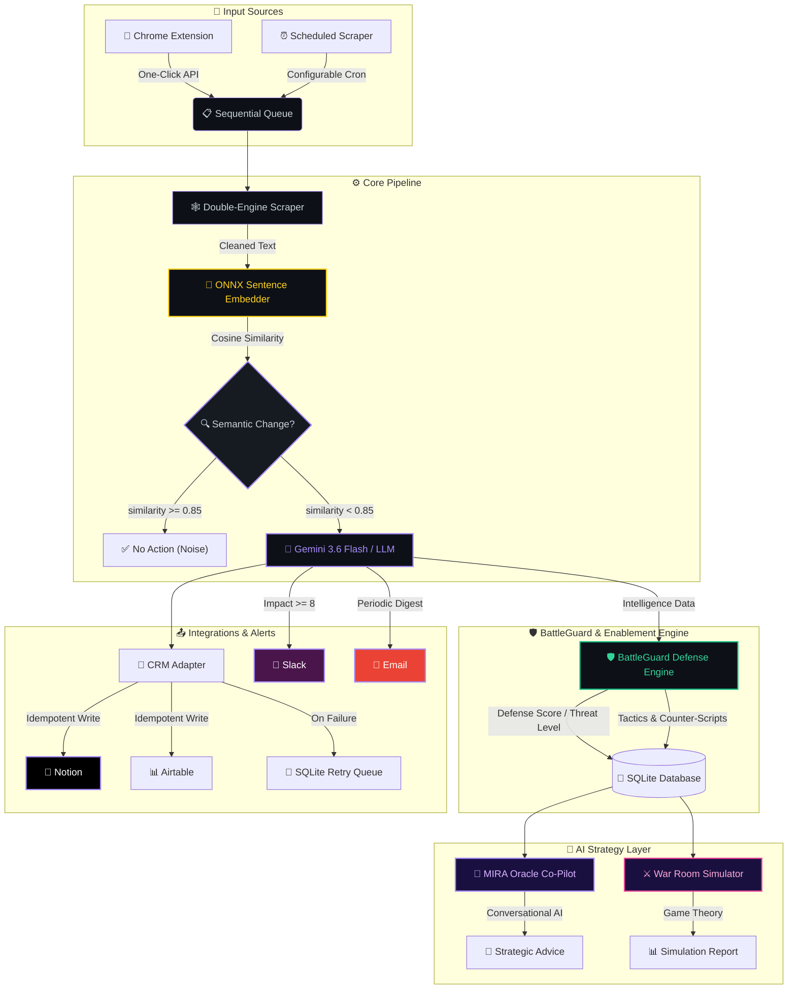
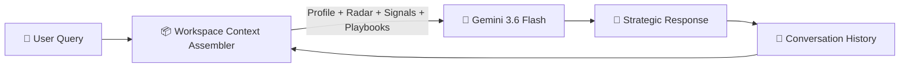

<div align="center">

<!-- Animated Banner -->
<picture>
  <source media="(prefers-color-scheme: dark)" srcset="docs/images/banner.svg">
  <source media="(prefers-color-scheme: light)" srcset="docs/images/banner.svg">
  
</picture>

<!-- Typing Animation -->
<a href="#-overview">

</a>

<br/>

<!-- Primary Badges -->
[](https://nodejs.org)
[](https://react.dev)
[](https://tailwindcss.com)
[](https://ai.google.dev)
[](https://huggingface.co)
[](https://developer.chrome.com)

[](https://slack.com)
[](https://notion.so)
[](mailto:)
[](https://sqlite.org)
[](https://docker.com)

<br/>


[](https://github.com/NitheshK4/Autonomous-Competitor-Intelligence-Engine/stargazers)

</div>

<br/>


## 📑 Table of Contents

<details open>
<summary>Click to expand</summary>

- [Overview](#-overview)
- [What's New in Latest Release](#-whats-new-in-latest-release)
- [Live Demo](#-live-demo)
- [System Architecture](#️-system-architecture)
- [ML & Prediction Pipeline](#-ml--prediction-pipeline)
- [BattleGuard Sales Enablement Defense Center](#-battleguard-sales-enablement-defense-center)
- [Multi-Model LLM Engine Selection](#-multi-model-llm-engine-selection)
- [AI Strategy Co-Pilot (MIRA Oracle)](#-ai-strategy-co-pilot--mira-oracle)
- [Competitive War Room Simulator](#️-competitive-war-room-simulator)
- [Chrome Extension](#-chrome-extension)
- [Quick Start](#-quick-start)
- [Environment Variables](#-environment-variables)
- [API Reference](#-api-reference)
- [Integration Guides](#-integration-guides)
- [Tech Stack](#️-tech-stack)
- [Project Structure](#-project-structure)
- [Deployment](#-deployment)
- [Known Limitations](#️-known-limitations)
- [Contributing](#-contributing)
- [License](#-license)

</details>


## 🌟 Overview

> **MIRA** (**M**arket **I**ntelligence & **R**esearch **A**utomation) is an autonomous, self-healing competitor monitoring engine powered by **Google Gemini 3.6 Flash**, an **AI Strategy Co-Pilot (MIRA Oracle)**, a **War Room Simulator**, and the **BattleGuard Sales Defense Matrix**. It scrapes competitor websites on a configurable schedule, detects *meaningful* content changes using **ONNX sentence embeddings**, evaluates business impact with custom Gemini models, generates sales playbooks, and pushes real-time alerts to **Slack**, **Email**, and **Notion / Airtable CRM** — all within a **512 MB RAM** footprint.

<br/>

<div align="center">

| 🔬 Scrape | 🧠 Detect | 📊 Predict & Score | 🛡️ BattleGuard | ⚔️ Simulate | 🚨 Alert |
|:---:|:---:|:---:|:---:|:---:|:---:|
| Cheerio + Puppeteer | ONNX Embeddings | Gemini 3.6 Flash / Qwen | 0–100 Defense Score | Game-Theory Engine | Slack + Email + CRM |
| Static & JS pages | Cosine similarity | Impact 1–10 + Signals | Threat Level & Tactics | Timeline & Playbooks | Webhooks + Retries |

</div>

<br/>

### ✨ Why MIRA?

<table>
<tr>
<td>

**🔮 Gemini 3.6 Flash Predictions**<br/>
Uses Google DeepMind's latest high-reasoning Gemini 3.6 Flash model by default for accurate market change predictions and threat scoring.

</td>
<td>

**🛡️ BattleGuard Defense Center**<br/>
Generates quantitative 0–100 Defense Scores, Threat Badges (`CRITICAL`, `HIGH`, `MODERATE`, `LOW`), defensive counter-tactics, and downloadable cheat sheets.

</td>
</tr>
<tr>
<td>

**🔄 Multi-Model LLM Selector**<br/>
Choose between Gemini 3.6 Flash, Gemini 3.0 Flash/Pro, Gemini 2.5, Gemini 2.0, or run 100% offline with an embedded Qwen2.5 GGUF CPU engine.

</td>
<td>

**🧠 Semantic Change Filtering**<br/>
Strips cosmetic noise (timestamps, view counters, copyright years). Changes are evaluated by *meaning* via ONNX embeddings (`all-MiniLM-L6-v2`).

</td>
</tr>
<tr>
<td>

**💬 AI Strategy Co-Pilot (Oracle)**<br/>
Ask MIRA Oracle anything — get instant positioning advice, elevator pitches, and sales objection handling scripts powered by live workspace data.

</td>
<td>

**⚔️ War Room Simulator**<br/>
"What if we drop prices 30%?" — simulate competitive market responses with predicted reaction timelines, risk scores, and counter-offensive playbooks.

</td>
</tr>
<tr>
<td>

**📢 Multi-Channel Alerts & CRMs**<br/>
Instant Slack webhooks (Impact ≥ 8), periodic Email summaries, and automated Notion / Airtable CRM database record creation.

</td>
<td>

**🩹 Self-Healing Idempotency**<br/>
Failed CRM syncs automatically queue in local SQLite with background exponential retries. Zero data loss guarantee.

</td>
</tr>
</table>


## 🆕 What's New in Latest Release

<div align="center">

```
  ┌──────────────────────────────────────────────────────────────────────────┐
  │                    🚀  MIRA LATEST RELEASE HIGHLIGHTS                     │
  ├──────────────────────────────────────────────────────────────────────────┤
  │                                                                          │
  │  🔮  GEMINI 3.6 FLASH PREDICTION ENGINE                                  │
  │      • Integrated Google DeepMind's newest Gemini 3.6 Flash model        │
  │      • Default reasoning engine for change detection & threat scoring    │
  │                                                                          │
  │  🛡️  BATTLEGUARD SALES DEFENSE CENTER                                    │
  │      • Quantitative 0-100 Defense Score Index & gauge display           │
  │      • Real-time threat level badges (CRITICAL, HIGH, MODERATE, LOW)     │
  │      • Competitor threat vectors & defensive counter-tactics             │
  │      • Interactive Objection Simulator with instant rep lookup          │
  │      • Downloadable Markdown BattleGuard cheat sheets (.md export)       │
  │                                                                          │
  │  ⚙️  MULTI-MODEL LLM SELECTION MATRIX                                    │
  │      • Dynamic dropdown selection in Settings panel                      │
  │      • Gemini 3.6 Flash, 3.0 Flash/Pro, 2.5 Flash/Pro, 2.0 Flash         │
  │      • Offline Qwen2.5 GGUF CPU engine fallback                          │
  │                                                                          │
  │  🎯  COMPREHENSIVE BATTLECARDS & ICP FIT                                 │
  │      • Target Persona & Ideal Customer Profile (ICP) breakdown         │
  │      • Customer Migration & Switching Triggers                           │
  │      • 30-Second Elevator & Displacement Pitch scripts                  │
  │                                                                          │
  └──────────────────────────────────────────────────────────────────────────┘
```

</div>


## 🚀 Live Demo

> The app is deployed on Railway and publicly accessible:

**👉 [https://autonomous-competitor-intelligence-engine-production.up.railway.app/](https://autonomous-competitor-intelligence-engine-production.up.railway.app/)**


## 🗺️ System Architecture




## 🧬 ML & Prediction Pipeline

<table>
<tr>
<td width="50%">

### 🧠 Stage 1 — ONNX Semantic Change Detection

**Runtime:** `@huggingface/transformers` (ONNX, JavaScript)  
**Model:** `Xenova/all-MiniLM-L6-v2`  

```javascript
const { pipeline } = require('@huggingface/transformers');

const embedder = await pipeline(
  'feature-extraction',
  'Xenova/all-MiniLM-L6-v2'
);

const oldEmbed = await embedder("Price is $100",
  { pooling: 'mean', normalize: true });
const newEmbed = await embedder("Current Price: $100",
  { pooling: 'mean', normalize: true });

// Cosine similarity = 0.93 ( >= 0.85 threshold )
// Same meaning — NO alert triggered ✅
```

> ❌ No brittle string diffs — MIRA understands *meaning*, eliminating false alarms caused by cosmetic rewording.

</td>
<td width="50%">

### 📊 Stage 2 — Gemini 3.6 Flash Impact Scoring

**Primary Model:** `gemini-3.6-flash`  
**Offline Engine:** `Qwen2.5-0.5B-Instruct` (GGUF via llama-cli)  

When a significant change occurs ($< 0.85$ similarity), MIRA runs an inference pass to output structured intelligence:

| Output Field | Purpose |
|:---|:---|
| 📂 **Category** | Classification (Pricing, Product, Hiring, Messaging) |
| 📝 **Summary** | Plain-English summary of what changed |
| ❓ **Why It Matters** | Impact analysis relative to your business |
| 📊 **Impact Score** | 1–10 quantitative severity rating |
| 📋 **Justification** | Evidence-backed reasoning |
| 🎯 **Recommendation** | Strategic action item with timeframe |

</td>
</tr>
</table>

### 🔄 3-Tier Multi-Model Fallback Chain

```
┌─────────────────────────┐     ┌────────────────────────────┐     ┌───────────────────────────┐
│   Gemini 3.6 Flash      │────▶│   Local Qwen2.5 GGUF       │────▶│  Quantitative Heuristic   │
│   (Cloud API, <1.2s)    │     │   (Local CPU Engine, 4-8s) │     │  Scoring Formula (<1ms)   │
└─────────────────────────┘     └────────────────────────────┘     └───────────────────────────┘
```


## 🛡️ BattleGuard Sales Enablement Defense Center

> **BattleGuard** turns raw competitor signals into actionable sales defense playbooks for revenue teams during live deals.

```
┌─────────────────────────────────────────────────────────────────────────────┐
│ 🛡️ BATTLEGUARD DEFENSE CENTER — APEX COMPETITOR                              │
├─────────────────────────────────────────────────────────────────────────────┤
│                                                                             │
│  📊 DEFENSE SCORE:   [ ██████████████████░░ ]  84 / 100                     │
│  🚨 THREAT LEVEL:    [ HIGH ]                                               │
│                                                                             │
│  🎯 THREAT VECTORS DETECTED:                                                │
│     • [PRICING] Competitor reduced entry plan by 30% ($100 → $70/mo)       │
│     • [FEATURE] Launched beta workflow automation module                    │
│                                                                             │
│  🛡️ DEFENSIVE TACTICS:                                                      │
│     1. Price Undercut Defense → Highlight zero add-on seat fees & low TCO   │
│     2. Product Superiority  → Demo ONNX real-time change detection & SLAs  │
│     3. Migration Guard     → Offer zero-friction onboarding & data import  │
│                                                                             │
│  💡 RECOMMENDED WIN ANGLE:                                                  │
│     "Position our solution as the modern, high-agility alternative with     │
│      superior ROI and zero lock-in."                                        │
│                                                                             │
└─────────────────────────────────────────────────────────────────────────────┘
```

### ⚡ Sub-Tabs & Features

1. **Overview & Differentiators**: Target ICP fit, 30-second elevator pitch, customer switching triggers, strengths, weaknesses, and why we win.
2. **BattleGuard Defense Matrix**: Visual Defense Score gauge, threat level badge, vector list, and tactical counter-strategies.
3. **Interactive Objection Simulator**: Live search tool allowing sales reps to type any buyer objection during a sales call to get an instant winning counter-script.
4. **Markdown Exporter**: Download ready-to-use `.md` cheat sheets with a single click.


## ⚙️ Multi-Model LLM Engine Selection

Configure your preferred LLM engine directly from the **Settings** panel:

| Model ID | Category | Description |
|:---|:---|:---|
| 🔮 **`gemini-3.6-flash`** | **Default / Primary** | Next-generation DeepMind model delivering highest accuracy & speed for predictions. |
| 🔥 **`gemini-3.0-flash`** | Next-Gen 3.0 | Next-generation Gemini 3.0 Flash inference engine. |
| 🌟 **`gemini-3.0-pro`** | Frontier Pro | High-reasoning Gemini 3.0 Pro for complex War Room simulations. |
| ✨ **`gemini-2.5-flash`** | High Performance | Fast and balanced intelligence model. |
| 🧠 **`gemini-2.5-pro`** | Deep Reasoning | Deep strategy and multi-competitor analysis. |
| ⚡ **`gemini-2.0-flash`** | Multimodal Fast | Next-gen low-latency multimodal engine. |
| 🚀 **`gemini-2.0-flash-lite`** | Ultra Low-Latency | Optimized for high-frequency objection handling lookups. |
| 💻 **`local-qwen-gguf`** | **100% Offline** | Standalone Qwen2.5 GGUF CPU engine (no API key required). |


## 🔮 AI Strategy Co-Pilot — MIRA Oracle

> **MIRA Oracle** is a conversational AI strategist with full real-time access to your competitive intelligence workspace.



### 💡 Strategy Quick-Prompt Chips

- 🎯 **Competitor SWOT**: Full SWOT breakdown of any tracked rival.
- 💰 **Pricing Strategy**: Pricing response strategy based on detected competitor moves.
- 📝 **Pitch Draft**: Custom 60-second displacement pitch scripts.
- 🛡️ **Objection Handling**: Real-time sales counter-scripts.
- 📊 **Executive Briefing**: Weekly summary of all market movements.


## ⚔️ Competitive War Room Simulator

> **"What if we drop prices by 30%?"** — The War Room models competitive market dynamics using game-theory simulation.

### 📊 Simulation Output

- 🎯 **Dynamic Risk Score**: 1–10 risk rating with threat level badge (`CRITICAL`, `HIGH`, `MODERATE`, `LOW`).
- 📈 **Market Impact Summary**: Broad market ripple effect analysis.
- 👥 **Competitor Responses**: Predicted reactions, probability percentages, and response timelines per rival.
- 🛡️ **Counter-Offensive Playbook**: Step-by-step tactical timeline (Days 1-7, Weeks 2-4, Month 2).
- ⚖️ **Strategic Verdict**: Clear decision recommendation (e.g. `PROCEED WITH CAUTION`).


## 🧩 Chrome Extension

Register competitors directly from your browser tab using the **Manifest V3 Chrome Extension**.

| Feature | Description |
|:---|:---|
| 🖱️ **One-Click Add** | Auto-detects URL and domain name from current active tab |
| 🔴 **Live Badge** | Service worker polls every 60s to light up an unread intel count badge |
| 🔑 **API Key Auth** | Requests authenticated via `Bearer` token |


## 🚀 Quick Start

### Prerequisites

```
✅ Node.js    v20+
✅ NPM        v10+
✅ OS         macOS / Linux / Windows (WSL)
```

### 1️⃣ Clone & Install

```bash
git clone https://github.com/NitheshK4/Autonomous-Competitor-Intelligence-Engine.git
cd Autonomous-Competitor-Intelligence-Engine

npm install
npm run install:all
```

> 💡 **No Python required.** All ML inference runs natively in Node.js.

### 2️⃣ Environment Configuration

```bash
cp .env.example .env
# Only PORT and NODE_ENV are needed in .env — all API keys (Gemini, Slack,
# Notion, Airtable, SMTP) are configured via the dashboard Settings tab.
```

### 3️⃣ Launch Application

```bash
npm run dev
```

| Service | URL |
|:---|:---|
| 🖥️ Backend Server | `http://localhost:3000` |
| 🎨 React Dashboard | `http://localhost:5173` |

### 4️⃣ Run Integration Verification Tests

```bash
npm test
```

> Runs all 5 integration test suites: Scraping → ONNX Detection → LLM Prediction → CRM Retry Queue → BattleGuard Metrics & DB Persistence.


## 🔐 Environment Variables

| Variable | Required | Default | Description |
|:---|:---:|:---:|:---|
| `PORT` | ✅ | `3000` | Express backend port |
| `NODE_ENV` | — | `development` | Environment mode (`production` / `development`) |
| `GEMINI_MODEL` | — | `gemini-3.6-flash` | Override default prediction model |
| `PUPPETEER_EXECUTABLE_PATH` | — | bundled | Chrome binary path override |


## 📡 API Reference

Dashboard endpoints require `x-workspace-id` header (defaults to `default`).

<details>
<summary><b>📋 Dashboard & BattleGuard Endpoints</b></summary>
<br/>

| Method | Endpoint | Description |
|:---|:---|:---|
| `GET` | `/health` | Server health check |
| `GET` | `/api/profile` | Get business profile |
| `POST` | `/api/profile` | Save business profile |
| `GET` | `/api/competitors` | List monitored competitors |
| `POST` | `/api/competitors` | Register new competitor |
| `POST` | `/api/competitors/:id/check` | Trigger immediate scrape & change detection |
| `GET` | `/api/intelligence` | List intelligence cards |
| `GET` | `/api/battlecards` | List all battlecards & BattleGuard playbooks |
| `GET` | `/api/battlecards/:competitorId` | Get battlecard for competitor |
| `POST` | `/api/battlecards/:competitorId/generate` | Generate / refresh BattleGuard playbook |
| `POST` | `/api/oracle/chat` | Send query to MIRA Oracle AI Co-Pilot |
| `POST` | `/api/warroom/simulate` | Run War Room scenario simulation |
| `GET` | `/api/settings` | Get settings (Gemini API key, Model selection, Webhooks) |
| `POST` | `/api/settings` | Update workspace settings |

</details>


## 🔌 Integration Guides

<details>
<summary><b>📓 Notion CRM Integration</b></summary>
<br/>

1. Create an integration at [Notion My Integrations](https://www.notion.so/my-integrations).
2. Share your target database with the integration.
3. Paste the **Notion Integration Token** and **Database ID** in MIRA **Settings**.

</details>

<details>
<summary><b>📊 Airtable CRM Integration</b></summary>
<br/>

1. Generate a Personal Access Token (PAT) with `data.records:write` permissions at [Airtable Tokens](https://airtable.com/create/tokens).
2. Enter your **Base ID**, **Table Name** (e.g. `Competitor Intel`), and **Token** in MIRA **Settings**.

</details>

<details>
<summary><b>💬 Slack Webhook Alerts</b></summary>
<br/>

1. Create an **Incoming Webhook** in your Slack workspace.
2. Paste the URL into MIRA **Settings** $\rightarrow$ High-impact changes ($\ge 8/10$) trigger instant alerts.

</details>


## 🛠️ Tech Stack

<div align="center">


</div>

<br/>

| Layer | Technology |
|:---|:---|
| 🖥️ **Backend** | Node.js 20, Express 4, SQLite (`sqlite3`), Axios, Cheerio, Puppeteer |
| 🎨 **Frontend** | React 18, Vite 5, Tailwind CSS 3, Lucide React Icons |
| 🧠 **AI & Prediction** | Google Gemini 3.6 Flash, HuggingFace ONNX (`all-MiniLM-L6-v2`), Qwen2.5 GGUF |
| 🛡️ **Sales Enablement** | BattleGuard Engine, Defense Index Gauge, Objection Simulator |
| 🔮 **Strategy AI** | MIRA Oracle Co-Pilot, War Room Simulator |
| 🔌 **Integrations** | Notion SDK, Airtable REST API, Slack Webhooks, Nodemailer SMTP |
| 🧩 **Extension** | Chrome Manifest V3, Service Workers |


## 📁 Project Structure

```
📦 MIRA — Autonomous Competitor Intelligence Engine
│
├── 📂 client/                     # React + Vite + Tailwind CSS Dashboard
│   ├── src/
│   │   ├── App.jsx                # Root application & Settings panel
│   │   ├── components/
│   │   │   ├── BattlecardsView.jsx   # 🛡️ Battlecards & BattleGuard Defense Center
│   │   │   ├── CommandPalette.jsx    # 🔍 Cmd+K global search & quick actions
│   │   │   ├── Sidebar.jsx           # 📱 Navigation sidebar
│   │   │   ├── StrategyCopilotModal.jsx # 🔮 MIRA Oracle AI chat modal
│   │   │   ├── VisualDiffModal.jsx   # 🗂️ Content diff modal
│   │   │   └── WarRoomView.jsx       # ⚔️ War Room scenario simulator
│   └── vite.config.js             # Vite configuration
│
├── 📂 server/                     # Express Backend Engine
│   └── src/
│       ├── index.js               # Express server, routes, cron runner
│       ├── scraper.js             # Double-engine scraper (Cheerio + Puppeteer)
│       ├── detector.js            # ONNX semantic change detection
│       ├── llm.js                 # Gemini 3.6 Flash + Oracle + War Room + BattleGuard
│       ├── crm.js                 # Notion & Airtable CRM adapter
│       ├── queue.js               # Sequential processing queue
│       ├── slack.js               # Slack webhook notifier
│       ├── db.js                  # SQLite database layer & schema migrations
│       └── verify-test.js         # Integration test suite
│
├── 📂 extension/                  # Chrome Extension (Manifest V3)
│   ├── manifest.json
│   ├── popup.html / popup.js      # One-click competitor registration
│   └── background.js              # Live unread badge polling service worker
│
├── Dockerfile                     # Production Container (Node 20 + Chrome)
└── package.json                   # Project scripts & dependencies
```


## 🐳 Deployment

### Railway (Recommended)

The included `Dockerfile` builds the React frontend, configures Chromium, installs ONNX dependencies, and launches the Express server automatically:

1. Connect your repository to [Railway](https://railway.app).
2. Set environment variables: `PORT=3000`, `NODE_ENV=production`.
3. Deploy! 🚀

### Docker (Manual)

```bash
docker build -t mira .
docker run -p 3000:3000 --env-file .env mira
```


## ⚠️ Known Limitations

| Area | Limitation & Handling |
|:---|:---|
| ⏳ **Initial Cold Start** | First run caches the ~90 MB ONNX model. Cached on disk thereafter. |
| 🤖 **Anti-Bot Defenses** | Sites with Cloudflare aggressive challenges fall back gracefully to Cheerio/Axios. |
| 📋 **Sequential Queue** | Single-worker queue keeps memory consumption under 512 MB RAM. |
| 🔄 **API Rate Limits** | Auto-retries on HTTP 429 and falls back to local CPU GGUF inference. |


## 🤝 Contributing

1. **Fork** the repository
2. **Create Branch** → `git checkout -b feature/amazing-feature`
3. **Commit Changes** → `git commit -m 'feat: Add amazing feature'`
4. **Push Branch** → `git push origin feature/amazing-feature`
5. **Open Pull Request**

Please run `npm test` before submitting PRs.


## 📜 License

Distributed under the **MIT License**. See [LICENSE](LICENSE) for more information.

<br/>

<div align="center">

[](LICENSE)
[](https://github.com/NitheshK4/Autonomous-Competitor-Intelligence-Engine/stargazers)

<br/>

<sub>🔮 MIRA Oracle • 🛡️ BattleGuard Sales Defense • 🔮 Gemini 3.6 Flash • ⚔️ War Room Simulator • 🧠 ONNX Semantic Detection</sub>

</div>
